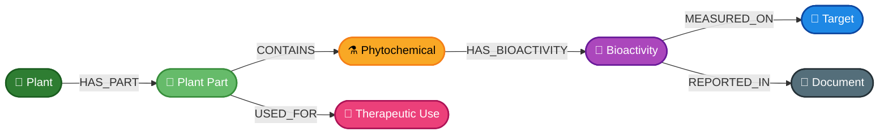
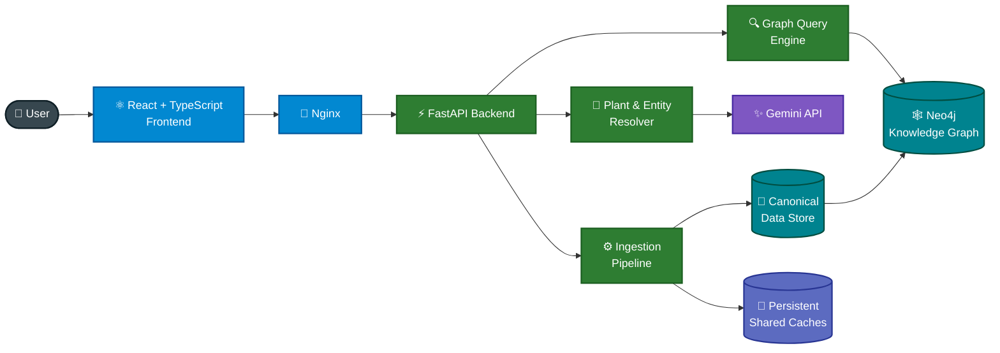
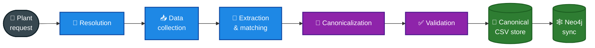
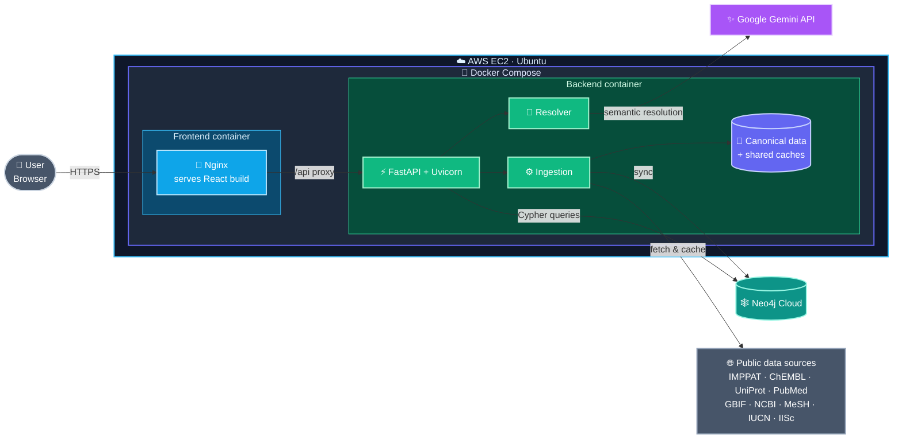

<div align="center">

# 🌿 VANA

### AI-Powered Ayurvedic Knowledge Graph & Research Platform

*From a plant name to its chemistry, bioactivity, targets, and evidence, all in one connected graph.*

<br/>


<br/>

**118** Plants &nbsp;·&nbsp; **2,446** Phytochemicals &nbsp;·&nbsp; **3,306** Bioactivities &nbsp;·&nbsp; **821** Research Documents

</div>

---

## 📖 Overview

Ayurvedic knowledge is scattered across botanical records, traditional-use texts, phytochemical databases, and scientific papers. **VANA** connects all of it into one graph so you can explore it end to end.

VANA combines four things:

| | Capability | What it does |
|---|---|---|
| 🧠 | **Semantic plant resolution** | Understands names, aliases, and typos, and resolves them against the existing graph first |
| 🕸️ | **Knowledge graph** | Models plants, parts, chemicals, uses, bioactivities, targets, and documents in Neo4j |
| ⚙️ | **Automated ingestion** | Pulls in new plants through a validated, cacheable, repeatable pipeline |
| 🔬 | **Evidence linking** | Ties each biological observation back to the research document that reports it |

---

## ✨ Key Features

### 📚 Evidence-Backed Data, Curated in One Place
VANA integrates nine trusted scientific and botanical sources into a single graph, so each fact stays traceable to where it came from.

| Source | What it contributes |
|---|---|
| **IMPPAT** | Phytochemicals, plant-part associations, therapeutic-use mappings |
| **ChEMBL** | Bioactivities, assays, targets, publications |
| **UniProt** | Protein / target identity resolution |
| **MeSH / NLM** | Therapeutic-use normalization and medical subject headings |
| **PubMed** | Supporting literature |
| **GBIF** | Botanical taxonomy and species resolution |
| **NCBI Taxonomy** | Taxonomy IDs and common names |
| **IUCN Red List** | Global conservation status |
| **IISc Digital Flora** | Karnataka regional status and plant / common-name information |

### 🧠 Graph-Constrained AI Resolution
Type `Hibicus` and get **Hibiscus rosa-sinensis**. Gemini can only choose from candidates that already exist in the graph, so it can't invent an identity or create a duplicate plant from a typo.

- Scientific names, common names, aliases, and spelling variations
- Deterministic fuzzy guard as a second layer of typo protection
- External resolution and ingestion only when no defensible match exists

### 🔗 Multi-Hop Graph Exploration
Move from a plant to its molecular evidence in one connected path:

`Plant → Plant Part → Phytochemical → Bioactivity → Target → Research Document`

### 🌱 Automated Plant Ingestion
A new plant goes through collection, extraction, canonicalization, and validation before it ever reaches the graph.

### 🛡️ Canonical-First Data Integrity
Canonical data, the Neo4j projection, lookup caches, and temporary outputs are kept separate. The graph can be validated, restored, and re-synced independently.

---

## 🧬 Knowledge Graph Model



---

## 🏗️ System Architecture



---

## 🔄 Data Pipeline



**Separation of concerns**

| Layer | Role |
|---|---|
| 📁 **Canonical store** | Authoritative structured dataset the graph is built from |
| 💾 **Persistent caches** | Cached external lookups for fewer requests and repeatable ingestion |
| 🕸️ **Neo4j** | Queryable graph projection used by the application |

---

## 📊 Production Graph

<table>
<tr>
<td valign="top">

**Nodes**

| Entity | Count |
|---|---:|
| 🌿 Plants | **118** |
| 🍃 Plant Parts | **612** |
| ⚗️ Phytochemicals | **2,446** |
| 💊 Therapeutic Uses | **552** |
| 🧪 Bioactivities | **3,306** |
| 🎯 Targets | **437** |
| 📄 Documents | **821** |

</td>
<td valign="top">

**Relationships**

| Type | Count |
|---|---:|
| `HAS_PART` | **612** |
| `CONTAINS` | **8,975** |
| `USED_FOR` | **7,528** |
| `HAS_BIOACTIVITY` | **3,818** |
| `MEASURED_ON` | **3,306** |
| `REPORTED_IN` | **3,306** |

</td>
</tr>
</table>

---

## ☁️ Deployment



The whole stack runs from one `docker compose up`. Only the frontend container is exposed publicly, and it proxies `/api` to the backend.

---

## 🧰 Tech Stack

| Layer | Technologies |
|---|---|
| **Frontend** | React · TypeScript · Vite · Nginx |
| **Backend** | Python · FastAPI · Uvicorn · Pydantic |
| **AI** | Google Gemini API |
| **Graph database** | Neo4j |
| **Data** | Pandas · OpenPyXL · CSV |
| **Data sources** | IMPPAT · ChEMBL · UniProt · MeSH / NLM · PubMed · GBIF · NCBI Taxonomy · IUCN Red List · IISc Digital Flora |
| **Caching** | Persistent JSON caches |
| **Infrastructure** | Docker · Docker Compose · AWS EC2 · Ubuntu |

---

## 🖼️ Screenshots

> Screenshots coming soon. Thank you for your patience.

<!--
<p align="center">
  
  
</p>
-->

---

## 🚀 Getting Started

```bash
# 1. Clone
git clone https://github.com/parthjain21108/VANA-Ayurvedic-Knowledge-Graph.git
cd VANA-Ayurvedic-Knowledge-Graph

# 2. Configure (see backend/.env.example)
cp backend/.env.example backend/.env

# 3. Run
docker compose up -d --build

# 4. Verify
docker compose ps
```

<details>
<summary><b>🔐 Required environment variables</b></summary>

<br/>

```text
NEO4J_URI
NEO4J_USERNAME
NEO4J_PASSWORD
NEO4J_DATABASE
GEMINI_API_KEY
```

Secrets are never committed. `.env.example` documents the configuration without exposing credentials.

</details>

<details>
<summary><b>🗂️ Project structure</b></summary>

<br/>

```text
VANA/
├── backend/
│   ├── api.py
│   ├── master.py
│   ├── query/
│   ├── ingestion/
│   ├── data_manager/
│   ├── phase1_release/
│   │   └── data/
│   │       ├── canonical/
│   │       └── shared_cache/
│   └── requirements*.txt
├── frontend/
│   ├── src/
│   ├── public/
│   ├── package.json
│   └── vite.config.ts
├── docs/assets/
├── docker-compose.yml
└── README.md
```

</details>

---

## 🧭 Design Principles

- **Graph-first resolution:** prefer existing knowledge over unnecessary external inference.
- **Canonical-first data:** keep structured source data separate from graph projections.
- **Evidence-linked relationships:** connect biological findings to supporting documents.
- **Controlled AI:** use AI for semantic reasoning, constrained by graph-backed candidates.
- **Reproducible ingestion:** persistent caches and canonical snapshots make runs repeatable.

---

## ⚠️ Disclaimer

VANA is a research and knowledge-exploration platform. Its output is not medical advice, diagnosis, or a substitute for consultation with a qualified healthcare professional.

---

<div align="center">

**Connecting traditional knowledge, modern biological data, and AI through a unified knowledge graph.**

Built by **[Parth Jain](https://github.com/parthjain21108)**

</div>
